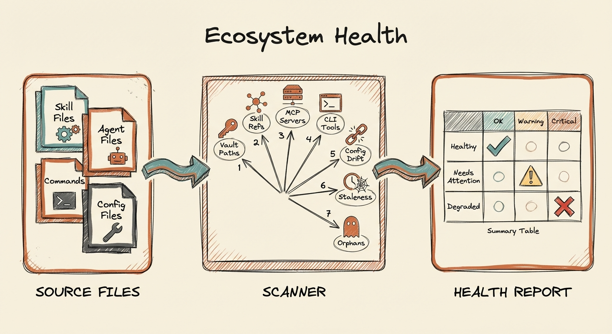

# claude-ecosystem-health

[](https://opensource.org/licenses/MIT)
[](https://docs.anthropic.com/en/docs/claude-code)



Detect drift between interconnected Claude Code components: skills, agents, MCP servers, vault paths, CLI tools, and configuration policies.

**The problem:** Complex Claude Code setups have dozens of skills, agents, and commands that reference each other by name, hardcode vault paths, and depend on MCP servers being configured. When something gets renamed, archived, or reconfigured, nothing detects the ripple effects. References break silently.

**The solution:** A single diagnostic skill that runs 7 checks across your entire Claude Code ecosystem and reports what's broken, stale, or misconfigured. Read-only by default.

## What It Catches

| Check | Severity | What It Finds |
|-------|----------|---------------|
| **Vault Path Validation** | Critical | Hardcoded paths to files/directories that don't exist |
| **Skill Cross-References** | High | References to skills that were renamed or archived |
| **MCP Server Health** | Critical | MCP tool references with no configured server (phantom tools) |
| **CLI Tool Availability** | Medium | CLI tools referenced but not installed |
| **Configuration Drift** | High | Policy violations (e.g., using MCP when CLI is preferred) |
| **Staleness Detection** | Low | Skills/agents not modified in 90+ days |
| **Orphan Detection** | Low | Non-invocable skills with zero references (dead code) |

## Requirements

- [Claude Code](https://docs.anthropic.com/en/docs/claude-code) installed and configured
- `jq` installed (for parsing `.claude.json` — `brew install jq` on macOS)
- Skills/agents/commands in `~/.claude/` directory structure

## Installation

### Option 1: Copy the skill file

```bash
mkdir -p ~/.claude/skills/ecosystem-health
cp SKILL.md ~/.claude/skills/ecosystem-health/SKILL.md
```

### Option 2: Clone and symlink

```bash
git clone https://github.com/aplaceforallmystuff/claude-ecosystem-health.git ~/Dev/claude-ecosystem-health
mkdir -p ~/.claude/skills/ecosystem-health
ln -s ~/Dev/claude-ecosystem-health/SKILL.md ~/.claude/skills/ecosystem-health/SKILL.md
```

## Setup

After installation, customize the skill for your environment. Open `SKILL.md` and update:

1. **Vault paths** (Check 1) — replace placeholder paths with your actual vault location
2. **CLI tools** (Check 4) — add the CLI tools your setup depends on
3. **CLI-over-MCP policies** (Check 5) — define which MCP tools have CLI replacements in your setup
4. **Report output path** — set where health reports should be saved
5. **MCP server aliases** (Check 3) — list any proxy MCP servers (e.g., Docker-based servers that wrap multiple APIs)

## Usage

```bash
# Full sweep (all 7 checks, monthly)
/ecosystem-health

# Quick check (checks 1-5, weekly)
/ecosystem-health --quick

# Single targeted check
/ecosystem-health --check vault-paths
/ecosystem-health --check skill-refs
/ecosystem-health --check mcp-servers
/ecosystem-health --check cli-tools
/ecosystem-health --check config-drift
/ecosystem-health --check staleness
/ecosystem-health --check orphans
```

## Output

The skill generates a structured markdown report with:

- Summary table (OK/Warning/Critical counts per check)
- Overall health rating (HEALTHY / NEEDS ATTENTION / DEGRADED)
- Detailed findings with affected files, line numbers, and remediation pointers
- Remediation summary table

### Health Thresholds

| Status | Criteria |
|--------|----------|
| **HEALTHY** | 0 critical, 0-2 warnings |
| **NEEDS ATTENTION** | 0 critical, 3+ warnings OR 1 critical |
| **DEGRADED** | 2+ critical findings |

## How It Works

The skill is a structured prompt that guides Claude Code through 7 diagnostic checks. Each check:

1. Scans source files (skills, agents, commands, hooks, CLAUDE.md)
2. Extracts references and patterns
3. Validates against the filesystem and configuration
4. Classifies findings by severity
5. Generates a report

No files are modified. The skill is read-only by design.

### Why `jq` Instead of Read?

`.claude.json` can exceed 40k tokens in complex setups. MCP servers are configured at multiple levels:
- Top-level `mcpServers`
- Project-level `projects["/path"].mcpServers`

The Read tool truncates large files, causing false positives (phantom servers that are actually configured at project level). `jq` extracts all server names regardless of file size.

## Lessons from Production

This skill was battle-tested on a production Claude Code setup with 119 skills, 47 agents, 71 commands, and 17 MCP servers. Key findings from the first run:

- **11 real issues found** on first run (broken paths, phantom MCP tools, wrong skill names)
- **4 false positives** from `.claude.json` being too large to read (fixed by using `jq`)
- **55 configuration drift warnings** from CLI-over-MCP policy violations
- **2 false positives** in model field check from matching inside code block examples

The Pitfalls & Lessons Learned section in SKILL.md documents every issue encountered during production use so you can avoid the same traps.

## When to Run

| Cadence | Mode | Use Case |
|---------|------|----------|
| Weekly | `--quick` | Part of weekly review — catches critical drift fast |
| Monthly | Full | First review of each month — includes staleness and orphan checks |
| After changes | `--check [name]` | After renaming, archiving, or reconfiguring anything |
| Debugging | `--check [name]` | When something "used to work" but stopped |

## Related Tools

This skill complements but doesn't replace:

- **Inventory/sync tools** — count and catalog everything (this skill validates health)
- **MCP maintenance tools** — manage individual servers (this skill detects which need attention)
- **Upgrade tools** — track Claude Code releases (this skill detects internal ecosystem drift)

## License

MIT - see [LICENSE](LICENSE)

## Author

Jim Christian ([@aplaceforallmystuff](https://github.com/aplaceforallmystuff))

Built as part of the [Cerebro](https://jimchristian.net) personal AI infrastructure project.
