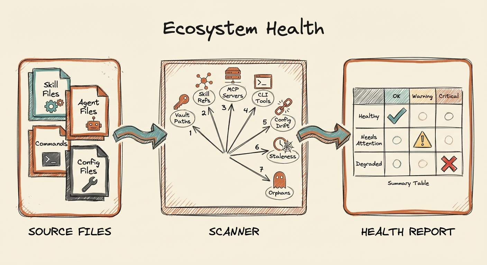

# Ecosystem Health

*Detect drift between skills, agents, MCP servers, vault paths, and CLI tools.*




Detect drift between interconnected Claude Code components: skills, agents, MCP servers, vault paths, CLI tools, and configuration policies.

## Why

**The problem:** Complex Claude Code setups have dozens of skills, agents, and commands that reference each other by name, hardcode vault paths, and depend on MCP servers being configured. When something gets renamed, archived, or reconfigured, nothing detects the ripple effects. References break silently.

**The solution:** A single diagnostic skill that runs 7 checks across your entire Claude Code ecosystem and reports what's broken, stale, or misconfigured. Read-only by default.

## What It Catches

| Check | Severity | What It Finds |
|-------|----------|---------------|
| **Vault Path Validation** | Critical | Hardcoded paths to files/directories that don't exist |
| **Skill Cross-References** | High | References to skills that were renamed or archived |
| **MCP Server Health** | Critical | MCP tool references with no configured server (phantom tools) |
| **CLI Tool Availability** | Medium | CLI tools referenced but not installed |
| **Configuration Drift** | High | Policy violations (e.g., using MCP when CLI is preferred) |
| **Staleness Detection** | Low | Skills/agents not modified in 90+ days |
| **Orphan Detection** | Low | Non-invocable skills with zero references (dead code) |

## Install

```bash
# In Claude Code:
/plugin marketplace add aplaceforallmystuff/marketplace
/plugin install claude-ecosystem-health@jim-christian
```

<details>
<summary>Manual install (without the marketplace)</summary>

```bash
git clone https://github.com/aplaceforallmystuff/claude-ecosystem-health.git
cp -r claude-ecosystem-health/skills/ecosystem-health ~/.claude/skills/
```
</details>

## Use cases

Use it when:

- You want a monthly full sweep across your whole Claude Code setup.
- You want a fast weekly check as part of your weekly review.
- You have just renamed, archived, or reconfigured a skill, agent, or MCP server.
- Something "used to work" but stopped, and you need to find what broke.
- You want a targeted diagnosis of one area: vault paths, skill references, MCP servers, CLI tools, or config drift.

## How It Works

The skill is a structured prompt that guides Claude Code through 7 diagnostic checks. Each check:

1. Scans source files (skills, agents, commands, hooks, CLAUDE.md)
2. Extracts references and patterns
3. Validates against the filesystem and configuration
4. Classifies findings by severity
5. Generates a report

No files are modified. The skill is read-only by design.

### Why `jq` Instead of Read?

`.claude.json` can exceed 40k tokens in complex setups. MCP servers are configured at multiple levels:
- Top-level `mcpServers`
- Project-level `projects["/path"].mcpServers`

The Read tool truncates large files, causing false positives (phantom servers that are actually configured at project level). `jq` extracts all server names regardless of file size.

### Project Structure

```
claude-ecosystem-health/
  install.sh                              # Installer script
  skills/
    ecosystem-health/
      SKILL.md                            # Main skill (lean, links to references)
      references/
        checks.md                         # Detailed check implementations (7 checks)
        pitfalls.md                       # Lessons learned from production runs
```

The skill uses **progressive disclosure**: the main SKILL.md is concise and links to reference files for detailed check procedures and pitfalls. This keeps the skill lean for Claude's context window while preserving all the operational detail.

## Example

Run a quick check as part of a weekly review:

```bash
# Full sweep (all 7 checks, monthly)
/ecosystem-health

# Quick check (checks 1-5, weekly)
/ecosystem-health --quick

# Single targeted check
/ecosystem-health --check vault-paths
/ecosystem-health --check skill-refs
/ecosystem-health --check mcp-servers
/ecosystem-health --check cli-tools
/ecosystem-health --check config-drift
/ecosystem-health --check staleness
/ecosystem-health --check orphans
```

The skill writes a markdown report and prints a console summary. Illustrative output:

```
Ecosystem Health: NEEDS ATTENTION

  Critical: 1 findings
  Warnings: 3 findings
  Info: 0 findings

Report saved to: ~/.claude/reports/ecosystem-health-report.md
```

The written report contains a summary table (OK/Warning/Critical counts per check), the overall health rating, detailed findings with affected files and line numbers, and a remediation summary table.

### Health Thresholds

| Status | Criteria |
|--------|----------|
| **HEALTHY** | 0 critical, 0-2 warnings |
| **NEEDS ATTENTION** | 0 critical, 3+ warnings OR 1 critical |
| **DEGRADED** | 2+ critical findings |

## Configuration

### Requirements

- [Claude Code](https://docs.anthropic.com/en/docs/claude-code) installed and configured
- `jq` installed (for parsing `.claude.json` -- `brew install jq` on macOS)
- Skills/agents/commands in `~/.claude/` directory structure

### Setup

After installation, customize the skill for your environment. The files contain placeholder patterns that need updating:

1. **Vault paths** (Check 1 in `references/checks.md`) -- replace placeholder paths with your actual vault location
2. **CLI tools** (Check 4) -- add the CLI tools your setup depends on
3. **CLI-over-MCP policies** (Check 5) -- define which MCP tools have CLI replacements in your setup
4. **Report output path** -- set where health reports should be saved
5. **MCP server aliases** (Check 3) -- list any proxy MCP servers (e.g., Docker-based servers that wrap multiple APIs)

## When to Run

| Cadence | Mode | Use Case |
|---------|------|----------|
| Weekly | `--quick` | Part of weekly review -- catches critical drift fast |
| Monthly | Full | First review of each month -- includes staleness and orphan checks |
| After changes | `--check [name]` | After renaming, archiving, or reconfiguring anything |
| Debugging | `--check [name]` | When something "used to work" but stopped |

## Lessons from Production

This skill was battle-tested on a large production Claude Code setup. The first run surfaced genuine issues -- broken paths, phantom MCP tools, stale skill references -- alongside a handful of false positives that led to the `jq` approach for config parsing and the code-block filtering in model checks.

The `references/pitfalls.md` file documents every issue encountered during production use so you can avoid the same traps.

## Related Skills

Part of the [aplaceforallmystuff](https://skills.sh/aplaceforallmystuff) skills collection:

- **[creation-guard](https://github.com/aplaceforallmystuff/claude-creation-guard)** — Prevent duplicate artifacts before creating new ones
- **[lessons-learned](https://github.com/aplaceforallmystuff/claude-lessons-learned)** — Structured retrospectives that implement fixes
- **[rfu-audit](https://github.com/aplaceforallmystuff/claude-rfu-audit)** — 11-gate utility validation before investing effort

This skill complements but doesn't replace:

- **Inventory/sync tools** — count and catalog everything (this skill validates health)
- **MCP maintenance tools** — manage individual servers (this skill detects which need attention)
- **Upgrade tools** — track Claude Code releases (this skill detects internal ecosystem drift)

## License

MIT — see [LICENSE](LICENSE).

## Author

[@aplaceforallmystuff](https://github.com/aplaceforallmystuff)
